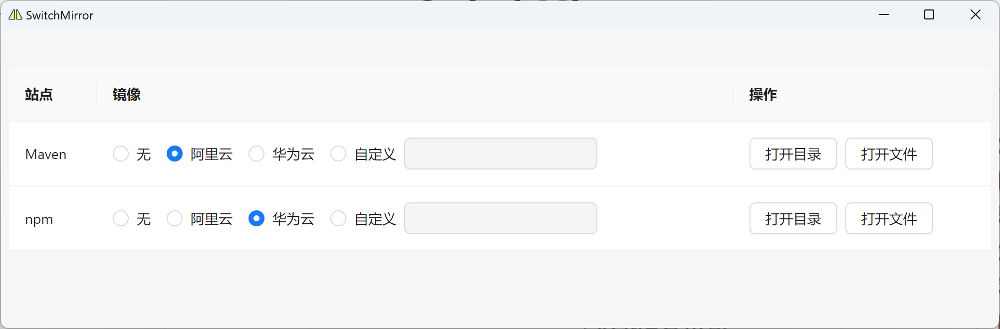

# SwitchMirror

一个简单的镜像切换工具，支持主流桌面平台，文件体积仅8MB左右。



## 功能

目前支持以下的镜像切换

- Maven

- npm


## 开发

安装

```
yarn install
```

运行

```
yarn tauri dev
```

编译

```
yarn tauri build
```

## 技术栈

[Tauri](https://github.com/tauri-apps/tauri)

[React](https://github.com/facebook/react)

[Ant Design](https://github.com/ant-design/ant-design)

[Icons8](https://icons8.com/)
